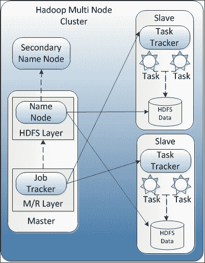
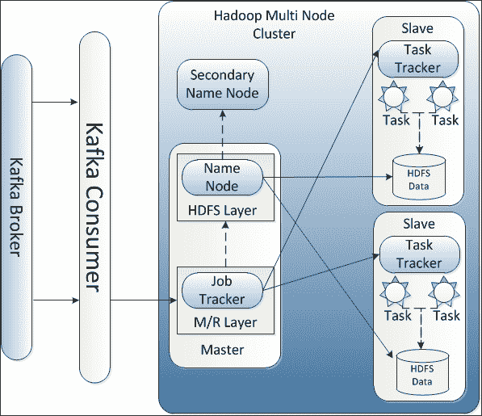

# 第六章。Kafka 集成

考虑一个网站的用例，其中需要跟踪连续的安全事件，例如用户身份验证和授权以访问安全资源，并且需要实时做出决策以应对任何安全漏洞。使用任何典型的面向批处理的数据处理系统，例如 Hadoop，需要首先收集所有数据，然后进行处理以揭示模式，这将使得判断是否存在对 Web 应用程序的安全威胁变得太晚。因此，这是实时数据处理的经典用例。

让我们考虑另一个用例，即通过网站使用生成的原始点击流被捕获和预处理。处理这些点击流可以为客户偏好提供有价值的见解，这些见解可以稍后与营销活动和推荐引擎相结合，以提供对消费者的分析。因此，我们可以简单地说，存储在 Hadoop 上的大量点击流数据将通过 Hadoop MapReduce 作业以批处理模式而不是实时模式进行处理。

在本章中，我们将探讨如何将 Kafka 与以下技术集成，以解决不同的用例，例如使用 Storm 进行实时处理，使用 Spark Streaming 进行批处理：

+   Kafka 与 Storm 的集成

+   Kafka 与 Hadoop 的集成

让我们开始吧。

# Kafka 与 Storm 的集成

使用诸如**Java 消息服务**（**JMS**）之类的技术实时处理少量数据从未是一个挑战；然而，当处理大量流数据时，这些处理系统显示出性能限制。此外，这些系统不是良好的横向可扩展的解决方案。

# 介绍 Storm

**Storm**是一个用于实时处理大量数据流的开源、分布式、可靠和容错系统。它支持许多用例，如实时分析、在线机器学习、连续计算和**ETL**（**Extract Transformation Load**）范式。

有各种组件一起工作进行流数据处理，如下所示：

+   **Spout**：这是连续的日志数据流。

+   **Bolt**：spout 将数据传递给一个名为**bolt**的组件。Bolt 可以消耗任意数量的输入流，进行一些处理，并可能发出新的流。例如，通过处理一系列推文来发出趋势分析流。

以下图表显示了 Storm 架构中的 spout 和 bolt：


我们可以假设 Storm 集群是一系列螺栓组件的链，其中每个螺栓对由 spout 流的数据进行某种转换。除了 spout 和 bolts 之外，还有一些其他组件，如下所示：

+   元组：这是 Storm 使用的本机数据结构（任何数据类型的名称列表值）。

+   流：这代表一系列元组。

+   Workers：这些代表 Storm 进程。

+   执行器：由 Storm 工作启动的 Storm 线程。在这里，工作可能运行一个或多个执行器，执行器可能运行一个或多个来自 spout 或 bolt 的 Storm 作业。

接下来在 Storm 集群中，作业通常被称为**拓扑**；唯一的区别是这些拓扑永远运行。对于 Storm 上的实时计算，通常会创建计算图形的拓扑。通常，拓扑定义了数据如何从 spouts 流经 bolts。这些拓扑可以是事务性的或非事务性的。

### 注意

有关 Storm 的完整信息可以在[`storm-project.net/`](http://storm-project.net/)找到。

如果您已经使用过 Storm 或对 Storm 有工作知识，下面的部分将会很有用。

## 集成 Storm

我们已经在之前的章节中学习到，Kafka 是一个具有高性能的基于发布-订阅的消息系统，具有高度可扩展的特性。Kafka spout 可用于将 Storm 与 Kafka 集群集成。

Kafka spout 是一个常规的 spout 实现，用于从 Kafka 集群中读取数据。这个 Kafka spout 之前可以在[`github.com/wurstmeister/storm-kafka-0.8-plus`](https://github.com/wurstmeister/storm-kafka-0.8-plus)找到，现在已经合并到核心 Storm 项目版本 0.9.2-incubating 中，并且可以在[`github.com/apache/storm/tree/master/external/storm-kafka`](https://github.com/apache/storm/tree/master/external/storm-kafka)找到。这个 storm-kafka spout 提供了关键功能，比如支持动态发现 Kafka 经纪人和“仅一次”元组处理。除了常规的 Kafka Storm spout，它还提供了 Kafka 的 Trident spout 实现。在本节中，我们将重点放在常规的 storm-kafka spout 上。

### 注意

Trident 是一个高级抽象，用于在 Storm 之上进行实时计算。它允许我们无缝地混合高吞吐量（每秒数百万条消息）、有状态的流处理和低延迟的分布式查询。更多信息请参见[`storm.apache.org/documentation/Trident-tutorial.html`](https://storm.apache.org/documentation/Trident-tutorial.html)。

两个 spout 实现都使用`BrokerHost`接口来跟踪 Kafka 经纪人主机到分区的映射和`KafkaConfig`参数。`ZkHosts`和`StaticHosts`提供了`BrokerHost`接口的两个实现。

`ZkHosts`实现用于动态跟踪 Kafka 经纪人到分区的映射，借助 Kafka 的 zookeeper 条目：

```java
public ZkHosts(String brokerZkStr, String brokerZkPath) 
public ZkHosts(String brokerZkStr)
```

前面的构造函数用于创建`ZkHosts`的实例。在这里，`brokerZkStr`可以是`localhost:9092`，`brokerZkPath`是存储所有主题和分区信息的根目录。`brokerZkPath`的默认值是`/brokers`。

`StaticHosts`实现用于静态分区信息，如：

```java
//localhost:9092\. Uses default port as 9092.
Broker brokerPartition0 = new Broker("localhost");

//localhost:9092\. Takes the port explicitly
Broker brokerPartition1 = new Broker("localhost", 9092);    

//localhost:9092 specified as one string.
Broker brokerPartition2 = new Broker("localhost:9092");    

GlobalPartitionInformation partitionInfo = new GlobalPartitionInformation();

//mapping form partition 0 to brokerPartition0
partitionInfo.addPartition(0, brokerPartition0);

//mapping form partition 1 to brokerPartition1
partitionInfo.addPartition(1, brokerPartition1);    

//mapping form partition 2 to brokerPartition2
partitionInfo.addPartition(2, brokerPartition2);

StaticHosts hosts = new StaticHosts(partitionInfo);
```

要创建`StaticHosts`实例，首先需要创建`GlobalPartitionInformation`的第一个实例，如前面的代码所示。接下来，需要创建`KafkaConfig`实例来构建 Kafka spout：

```java
public KafkaConfig(BrokerHosts hosts, String topic)
public KafkaConfig(BrokerHosts hosts, String topic, String clientId)
```

前面的构造函数需要以下参数：

+   Kafka 经纪人列表

+   用于读取消息的主题名称

+   客户端 ID，作为 Zookeeper 路径的一部分，其中 spout 作为消费者存储当前的消费偏移量。

`KafkaConfig`类还有一堆公共变量，用于控制应用程序的行为以及 spout 如何从 Kafka 集群中获取消息：

```java
  public int fetchSizeBytes = 1024 * 1024;
  public int socketTimeoutMs = 10000;
  public int fetchMaxWait = 10000;
  public int bufferSizeBytes = 1024 * 1024;
  public MultiScheme scheme = new RawMultiScheme();
  public boolean forceFromStart = false;
  public long startOffsetTime = 
        kafka.api.OffsetRequest.EarliestTime();
  public long maxOffsetBehind = Long.MAX_VALUE;
  public boolean useStartOffsetTimeIfOffsetOutOfRange = true;
  public int metricsTimeBucketSizeInSecs = 60;
```

`Spoutconfig`类扩展了`KafkaConfig`类，以支持`zkroot`和`id`两个额外的值：

```java
public SpoutConfig(BrokerHosts hosts, String topic, String zkRoot, String id);
```

前面的构造函数还需要以下内容：

+   在 Zookeeper 中的根路径，spout 存储消费者偏移量。

+   spout 的唯一标识

以下代码示例显示了使用先前参数初始化`KafkaSpout`类实例：

```java
// Creating instance for BrokerHosts interface implementation
BrokerHosts hosts = new ZkHosts(brokerZkConnString);

// Creating instance of SpoutConfig
SpoutConfig spoutConfig = new SpoutConfig(brokerHosts, topicName, "/" + topicName, UUID.randomUUID().toString());

// Defines how the byte[] consumed from kafka gets transformed into // a storm tuple
spoutConfig.scheme = new SchemeAsMultiScheme(new StringScheme());

// Creating instance of KafkaSpout
KafkaSpout kafkaSpout = new KafkaSpout(spoutConfig);
```

以下图表显示了 Kafka Storm 工作模型的高级集成视图：


Kafka spout 使用与 Apache Storm 相同的 Zookeeper 实例来存储消息偏移和段消费跟踪的状态，如果它被消费。这些偏移量存储在 Zookeeper 指定的根路径下。Kafka spout 使用这些偏移量在下游故障或超时的情况下重放元组。尽管它也有一个重新回到先前偏移的规定，而不是从最后保存的偏移开始，Kafka 会选择在指定时间戳周围写入的最新偏移量：

```java
spoutConfig.forceStartOffsetTime(TIMESTAMP);
```

这里的值`-1`强制 Kafka spout 从最新的偏移重新启动，`-2`强制 spout 从最早的偏移重新启动。

这个 storm-kafka spout 也有一个，因为它不支持 Kafka 0.7x 经纪人，只支持 Kafka 0.8.1.x 及以上版本。

### 注意

要运行 Kafka 与 Storm，需要设置并运行 Storm 和 Kafka 的集群。Storm 集群设置超出了本书的范围。

# Kafka 与 Hadoop 集成

资源共享、稳定性、可用性和可扩展性是分布式计算的许多挑战之一。如今，另一个挑战是处理 TB 或 PB 级别的极大数据量。

## 介绍 Hadoop

Hadoop 是一个大规模分布式批处理框架，可以在许多节点上并行处理数据，并解决了分布式计算，包括大数据的挑战。

Hadoop 基于 MapReduce 框架的原则（由 Google 引入），为大规模计算的并行化和分布提供了一个简单的接口。Hadoop 有自己的分布式数据文件系统称为**Hadoop 分布式文件系统**（**HDFS**）。在任何典型的 Hadoop 集群中，HDFS 将数据分割成小块（称为**块**）并将其分发到所有节点。HDFS 还复制这些小数据块并存储它们，以确保如果任何节点宕机，数据可以从另一个节点获取。

以下图显示了多节点 Hadoop 集群的高级视图：



Hadoop 有以下主要组件：

+   **名称节点**：这是 HDFS 的交互单点。名称节点存储有关分布在节点上的数据小块（块）的信息。

+   **辅助名称节点**：此节点存储编辑日志，有助于在名称节点故障的情况下恢复 HDFS 的最新更新状态。

+   **数据节点**：这些节点存储名称节点分发的实际数据块，并存储来自其他节点的复制数据。

+   **作业跟踪器**：这负责将 MapReduce 作业拆分为较小的任务。

+   **任务跟踪器**：任务跟踪器负责执行由作业跟踪器拆分的任务。

数据节点和任务跟踪器共享相同的机器和 MapReduce 作业拆分；任务的执行是基于名称节点提供的数据存储位置信息完成的。

现在在讨论 Kafka 与 Hadoop 集成之前，让我们快速在伪分布式模式下设置单节点 Hadoop 集群。

### 注意

Hadoop 集群可以在三种不同的模式下设置：

+   本地模式

+   伪分布式模式

+   完全分布式模式

本地模式和伪分布式模式在单节点集群上运行。在本地模式下，所有 Hadoop 主要组件在单个 JVM 实例中运行；而在伪分布式模式下，每个组件在单个节点上的单独 JVM 实例中运行。伪分布式模式主要由开发人员用作开发环境。在完全分布式模式下，所有组件都在单独的节点上运行，并且用于测试和生产环境。

以下是用于创建伪分布式模式集群的步骤：

1.  安装和配置 Java。参考第一章中的*安装 Java 1.7 或更高版本*部分，*介绍 Kafka*。

1.  从[`www.apache.org/dyn/closer.cgi/hadoop/common/`](http://www.apache.org/dyn/closer.cgi/hadoop/common/)下载当前稳定的 Hadoop 分发包。

1.  在`/opt`中解压下载的 Hadoop 分发包，并将 Hadoop 的`bin`目录添加到路径中，如下所示：

```java
 # Assuming your installation directory is /opt/Hadoop-2.6.0
 [root@localhost opt]#export HADOOP_HOME=/opt/hadoop-2.6.0
 [root@localhost opt]#export PATH=$PATH:$HADOOP_HOME/bin
```

1.  添加以下配置：

```java
etc/hadoop/core-site.xml:
<configuration>
    <property>
        <name>fs.defaultFS</name>
        <value>hdfs://localhost:9000</value>
    </property>
</configuration>

 etc/hadoop/hdfs-site.xml:
<configuration>
    <property>
        <name>dfs.replication</name>
        <value>1</value>
    </property>
</configuration>
```

1.  在本地主机上设置 ssh，无需密码短语：

```java
[root@localhost opt]# ssh localhost
```

如果 ssh-to-localhost 在没有密码短语的情况下无法工作，请执行以下命令：

```java
[root@localhost opt]# ssh-keygen -t dsa -P '' -f ~/.ssh/id_dsa [root@localhost opt]# cat ~/.ssh/id_dsa.pub >> ~/.ssh/authorized_keys

```

1.  格式化文件系统：

```java
[root@localhost opt]# bin/hdfs namenode -format

```

1.  启动 NameNode 守护程序和 DataNode 守护程序：

```java
[root@localhost opt]# sbin/start-dfs.sh

```

一旦成功设置了 Hadoop 集群，请在`http://localhost:50070/`上浏览 NameNode 的 Web 界面。

## 集成 Hadoop

如果您已经使用过 Hadoop 或对 Hadoop 有工作经验，本节将非常有用。

对于实时发布-订阅用例，Kafka 用于构建可用于实时处理或监控的管道，并将数据加载到 Hadoop、NoSQL 或数据仓库系统中进行离线处理和报告。

Kafka 在其`contrib`目录下提供了 Hadoop 生产者和消费者的源代码。

## Hadoop 生产者

Hadoop 生产者提供了从 Hadoop 集群向 Kafka 发布数据的桥梁，如下图所示：


对于 Kafka 生产者，Kafka 主题被视为 URI，并且为了连接到特定的 Kafka 代理，URI 被指定如下：

```java
kafka://<kafka-broker>/<kafka-topic>
```

Hadoop 生产者代码提出了从 Hadoop 获取数据的两种可能方法：

+   **使用 Pig 脚本并以 Avro 格式编写消息**：在这种方法中，Kafka 生产者使用 Pig 脚本以二进制 Avro 格式编写数据，其中每行表示单个消息。对于将数据推送到 Kafka 集群，`AvroKafkaStorage`类（它扩展了 Pig 的`StoreFunc`类）将 Avro 模式作为其第一个参数，并连接到 Kafka URI。使用`AvroKafkaStorage`生产者，我们还可以在同一个基于 Pig 脚本的作业中轻松写入多个主题和代理。在编写 Pig 脚本时，还需要注册所需的 Kafka JAR 文件。以下是示例 Pig 脚本：

```java
    REGISTER hadoop-producer_2.8.0-0.8.0.jar;
    REGISTER avro-1.4.0.jar;
    REGISTER piggybank.jar;
    REGISTER kafka-0.8.0.jar;
    REGISTER jackson-core-asl-1.5.5.jar;
    REGISTER jackson-mapper-asl-1.5.5.jar;
    REGISTER scala-library.jar;

member_info = LOAD 'member_info.tsv' AS (member_id : int, name : chararray);

names = FOREACH member_info GENERATE name;

STORE member_info INTO 'kafka://localhost:9092/member_info' USING kafka.bridge.AvroKafkaStorage('"string"');
```

在上述脚本中，Pig 的`StoreFunc`类利用 Piggybank 中的`AvroStorage`将数据从 Pig 的数据模型转换为指定的 Avro 模式。

+   **使用作业的 Kafka OutputFormat 类**：在这种方法中，Kafka 的`OutputFormat`类（它扩展了 Hadoop 的`OutputFormat`类）用于将数据发布到 Kafka 集群。使用 0.20 MapReduce API，这种方法将消息作为字节发布，并通过使用低级别的发布方法来控制输出。Kafka 的`OutputFormat`类使用`KafkaRecordWriter`类（它扩展了 Hadoop 的`RecordWriter`类）来将记录（消息）写入 Hadoop 集群。

对于 Kafka 生产者，我们还可以通过在作业配置中加上`kafka.output`前缀来配置 Kafka 生产者参数。例如，要更改压缩编解码器，添加`kafka.output.compression.codec`参数（例如，在 Pig 脚本中添加`SET kafka.output.compression.codec 0`表示不压缩）。除了这些值，Kafka 代理信息（`kafka.metadata.broker.list`）、主题（`kafka.output.topic`）和模式（`kafka.output.schema`）也被注入到作业的配置中。

## Hadoop 消费者

Hadoop 消费者是从 Kafka 代理中拉取数据并将其推送到 HDFS 的 Hadoop 作业。以下图表显示了 Kafka 消费者在架构模式中的位置：



一个 Hadoop 作业执行从 Kafka 到 HDFS 的并行加载，加载数据的 mapper 数量取决于输入目录中文件的数量。输出目录包含来自 Kafka 的数据和更新的主题偏移量。单独的 mapper 在 map 任务结束时将最后消费的消息的偏移量写入 HDFS。如果作业失败并且作业重新启动，每个 mapper 都会从 HDFS 中存储的偏移量重新启动。

`Kafka-0.8.1.1-src/contrib/hadoop-consumer`目录中提供的 ETL 示例演示了从 Kafka 中提取数据并将其加载到 HDFS。例如，它需要来自配置文件的以下输入，例如`test/test.properties`：

+   `kafka.etl.topic`：要获取的主题。

+   `kafka.server.uri`：Kafka 服务器 URI。

+   `input`：包含由`DataGenerator`生成的主题偏移量的输入目录。此目录中的文件数量决定了 Hadoop 作业中的 mapper 数量。

+   `output`：包含 Kafka 数据和更新的主题偏移量的输出目录。

+   `kafka.request.limit`：用于限制获取的事件数量。

在卡夫卡消费者中，`KafkaETLRecordReader`实例是与`KafkaETLInputFormat`相关联的记录读取器。它从服务器获取卡夫卡数据，从提供的偏移量（由`input`指定）开始，并在达到最大可用偏移量或指定限制（由`kafka.request.limit`指定）时停止。`KafkaETLJob`还包含一些辅助函数来初始化作业配置，`SimpleKafkaETLJob`设置作业属性并提交 Hadoop 作业。一旦作业启动，`SimpleKafkaETLMapper`将卡夫卡数据转储到 HDFS（由`output`指定）。

# 摘要

在本章中，我们主要学习了卡夫卡如何与现有的开源框架在实时/批处理数据处理领域集成。在实时数据处理领域，卡夫卡与使用现有的 Storm spout 的 Storm 集成。至于批处理数据处理，卡夫卡带来了基于 Hadoop 的数据生产者和消费者，使数据可以发布到 HDFS，使用 MapReduce 进行处理，然后消费。

在下一章中，也是本书的最后一章，我们将看一些关于卡夫卡的其他重要事实。
