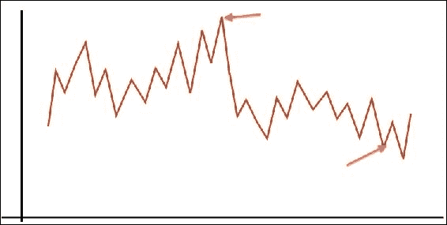
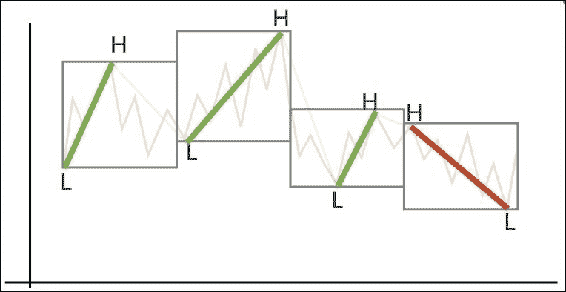
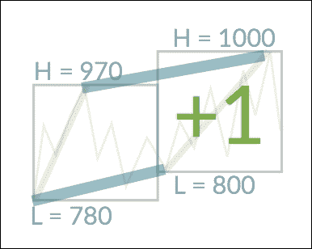
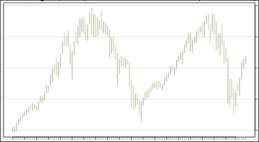

# 第十二章。TrendCalculus

在数据科学家开始研究趋势成为一个热门话题之前，有一个更古老的概念，至今仍未得到很好的数据科学服务：趋势。目前，对趋势的分析，如果可以这样称呼的话，主要是由人们“用眼睛看”时间序列图表并提供解释。但人们的眼睛在做什么呢？

本章描述了在 Apache Spark 中实现的一种用于数值研究趋势的新算法，称为 TrendCalculus，由 Andrew Morgan 发明。原始的参考实现是用 Lua 语言编写的，并于 2015 年开源，代码可以在[`bitbucket.org/bytesumo/trendcalculus-public`](https://bitbucket.org/bytesumo/trendcalculus-public)上查看。

本章解释了核心方法，它可以快速提取时间序列上的趋势变化点；这些是趋势改变方向的时刻。我们将详细描述我们的 TrendCalculus 算法，并在 Apache Spark 中实现它。结果是一组可扩展的函数，可以快速比较时间序列上的趋势，以推断趋势并检查不同时间范围内的相关性。使用这些颠覆性的新方法，我们演示了如何构建因果排名技术，以从成千上万的时间序列输入中提取潜在的因果模型。

在本章中，我们将学习：

+   如何有效构建时间窗口摘要数据

+   如何有效地总结时间序列数据以减少噪音，以进行进一步的趋势研究

+   如何使用新的 TrendCalculus 算法从摘要数据中提取趋势反转*变化点*

+   如何创建在复杂*窗口*功能创建的分区上操作的**用户定义的聚合函数**（**UDAFs**），以及更常见的*group by*方法

+   如何从 UDAFs 返回多个值

+   如何使用滞后函数比较当前和先前的记录

当面临问题时，数据科学家首先考虑的假设之一与趋势有关；趋势是提供数据可视化的绝佳方式，特别适用于大型数据集，其中数据的一般变化方向通常是可见的。在第五章《用于地理分析的 Spark》中，我们制定了一个简单的算法来尝试预测原油价格。在那项研究中，我们集中于价格的变化方向，也就是价格的趋势。我们看到，趋势是一种自然的思考、解释和预测方式。

为了解释和演示我们的新趋势方法，本章分为两个部分。第一部分是技术性的，提供我们执行新算法所需的代码。第二部分是关于在真实数据上应用该方法。我们希望它能证明，趋势作为一个概念的表面简单性通常比我们最初想到的更复杂，特别是在存在噪音的情况下。噪音导致许多局部高点和低点（在本章中称为抖动），这可能使得确定趋势转折点和发现随时间变化的一般方向变得困难。忽略时间序列中的噪音，并提取可解释的趋势信号，提供了我们演示如何克服的核心挑战。

# 研究趋势

趋势的词典定义是某事物发展或变化的一般方向，但还有其他更专注的定义可能更有助于引导数据科学。其中两个定义来自研究社会趋势的 Salomé Areias 和欧盟官方统计机构 Eurostat：

*“趋势是指在较长时期内缓慢变化，通常是几年，通常与影响所测量现象的结构性原因有关。”* - 欧盟官方统计机构 EUROSTAT（[`ec.europa.eu/eurostat/statistics-explained/index.php/Glossary:Trend`](http://ec.europa.eu/eurostat/statistics-explained/index.php/Glossary:Trend)）

*“趋势是指行为或心态的转变，影响大量人群。”* - Salomé Areias，社会趋势评论员（[`salomeareias.wordpress.com/what-is-a-trend/`](https://salomeareias.wordpress.com/what-is-a-trend/)）

我们通常认为趋势不过是股市价格的长期上涨或下跌。然而，趋势也可以指与经济、政治、流行文化和社会相关的许多其他用例：例如，媒体报道新闻时揭示的情绪研究。在本章中，我们将以石油价格作为简单的演示；然而，该技术可以应用于任何趋势发生的数据：

+   **上升趋势**：当连续的峰值和低谷较高（高峰和低谷）时，称为向上或上升趋势。例如，以下图表中的第一个箭头是一系列峰值和低谷的结果，整体效果是增加。

+   **下降趋势**：当连续的峰值和低谷较低（低峰和低谷）时，称为向下或下降趋势。例如，以下图表中的第二个箭头是一系列峰值和低谷的结果，整体效果是下降。

+   **水平趋势**：这不是严格意义上的趋势，而是在任何方向上都没有明确定义的趋势。我们目前不特别关注这一点，但在本章后面会讨论。



### 注意

如果您搜索“higher highs”“higher lows”“trend”“lower highs”“lower lows”，您将看到超过 16,000 个结果，包括许多知名的金融网站。这是金融行业中趋势的标准做法和经验法则定义。

# TrendCalculus 算法

在本节中，我们将使用第五章“地理分析的 Spark”中看到的布伦特原油价格数据集作为示例用例，解释 TrendCalculus 实现的细节。

## 趋势窗口

为了衡量任何类型的变化，我们必须首先以某种方式对其进行量化。对于趋势，我们将以以下方式定义：

+   总体积极变化（通常表示为值增加）

Higher highs and higher lows => +1

+   总体消极变化（通常表示为值减少）

Lower highs and lower lows => -1

因此，我们必须将我们的数据转换为趋势方向的时间序列，即+1 或-1。通过将我们的数据分割成一系列窗口，大小为*n*，我们可以计算每个窗口的日期高点和低点：



由于这种窗口化在数据科学中是一种常见的做法，因此合理地认为 Spark 中一定有一个实现；如果您阅读了第五章，“地理分析的 Spark”，您将会看到它们，以 Spark SQL 窗口函数的形式。让我们读取一些布伦特原油数据，这种情况下只是日期和当天原油收盘价（示例数据位于我们的代码库中）：

```scala
// Read in the data
val oilPriceDF = spark
   .read
   .option("header","true")
   .option("inferSchema", "true")
   .csv("brent_oil_prices.csv")
```

接下来，我们应该确保日期字段模式正确，以便我们可以在`window`函数中使用它。我们的示例数据集具有`dd/MM/yyyy`格式的`String`日期，因此我们将使用`java.text.SimpleDateFormat`将其转换为`yyyy-MM-dd`：

```scala
// A date conversion UDF
def convertDate(date:String) : String = {
     val dt = new SimpleDateFormat("dd/MM/yyyy").parse(date)
     val newDate = new SimpleDateFormat("yyyy-MM-dd").format(dt)
     newDate
}
```

这将使我们能够创建一个**用户定义函数**（**UDF**），我们可以用它来替换`oilPriceDF` DataFrame 中已有的日期列：

```scala
val convertDateUDF = udf {(Date: String) => convertDate(Date)}
val oilPriceDatedDF = oilPriceDF
    .withColumn("DATE", convertDate(oilPriceDF("DATE")))
```

作为一个快速的旁注，如果我们想要集中在数据的特定范围上，我们可以对其进行过滤：

```scala
val oilPriceDated2015DF = oilPriceDatedDF.filter("year(DATE)==2015")
```

现在我们可以使用 Spark 2.0 中引入的窗口函数来实现窗口：

```scala
val windowDF = oilPriceDatedDF.groupBy(
   window(oilPriceDatedDF.col("DATE"),"1 week", "1 week", "4 days"))
```

前述声明中的参数允许我们提供窗口大小、窗口偏移和数据偏移，因此这个模式实际上产生了一个带有数据开头偏移的滚动窗口。这样可以确保每个窗口都是构建的，以便始终包含星期一到星期五的数据（石油交易日），每个后续窗口都包含下一周的数据。

在这个阶段查看 DataFrame 以确保一切井然有序；我们不能像通常那样使用`show`方法，因为`windowDF`是一个`RelationalGroupedDataset`。因此，我们可以运行一个简单的内置函数来创建可读的输出。计算每个窗口的内容，显示前二十行并且不截断输出：

```scala
windowDF.count.show(20, false)
```

这将类似于这样：

```scala
+---------------------------------------------+-----+ 
|window                                       |count| 
+---------------------------------------------+-----+ 
|[2011-11-07 00:00:00.0,2011-11-14 00:00:00.0]|5    | 
|[2011-11-14 00:00:00.0,2011-11-21 00:00:00.0]|5    | 
|[2011-11-21 00:00:00.0,2011-11-28 00:00:00.0]|5    | 
+---------------------------------------------+-----+ 

```

这里，count 是窗口中的条目数，也就是我们的情况下的价格数。根据使用的数据，我们可能会发现一些窗口包含少于五个条目，因为数据缺失。我们将保留这些数据，否则输出中将会出现间断。

### 注意

在处理新数据集之前，绝对不能忽视数据质量，并且必须始终进行尽职调查，参见第四章*探索性数据分析*。

更改窗口大小*n*（在本例中为 1 周）将调整我们的调查规模。例如，大小为 1 周的*n*将提供每周的变化，而大小为 1 年的*n*将提供每年的变化（每个窗口的大小将为：[交易的周数*5]使用我们的数据）。当然，这完全取决于数据集的结构，即是否为每小时或每日价格等。在本章后面，我们将看到如何可以轻松地迭代地检查趋势，将数据的变化点作为第二次迭代的输入。

## 简单趋势

现在我们有了窗口化的数据，我们可以计算每个窗口的+1 或-1 值（简单趋势），因此我们需要制定一个趋势计算方程。我们可以通过前面图表中的示例进行可视化处理：


对于计算出的窗口集，我们可以将当前窗口与上一个窗口进行比较，从而显示更高的高点、更低的低点和更低的高点、更低的低点。

我们通过从每个窗口中选择以下内容来实现这一点：

+   最早的高价

+   最新的低价

利用这些信息，我们可以推导出我们的 TrendCalculus 方程：


其中：

+   **sign**：是函数（x > 0）？1：（（x < 0）？-1：0）

+   **H**：高

+   **L**：低

+   **Pi**：当前窗口

+   **Pi -1**：上一个窗口

例如，给定以下情景：



+   简单趋势 = sign(sign(HighDiff) + sign(LowDiff))

+   简单趋势 = sign(sign(1000-970) + sign(800-780))

+   简单趋势 = sign(sign(30) + sign(20))

+   简单趋势 = sign(1 + 1)

+   简单趋势 = sign(2)

+   简单趋势 = +1

也可能获得答案为 0。这将在本章后面详细解释，参见*边缘案例*。

## 用户定义的聚合函数

有许多方法可以以编程方式执行上述任务，我们将看看用于聚合数据的 UDF（Spark `UserDefinedAggregateFunction`），以便我们可以使用先前收集的窗口化数据。

我们希望能够像以前的 UDF 示例一样在窗口上使用函数。但是，标准 UDF 是不可能的，因为我们的窗口被表示为`RelationalGroupedDataset`。在运行时，这样一个集合的数据可能保存在多个 Spark 节点上，因此函数是并行执行的，而不是 UDF 的数据必须是共同定位的。因此，UDAF 对我们来说是一个好消息，因为这意味着我们可以在程序逻辑中实现并行化效率的关注点被抽象化，并且代码将自动扩展到大规模数据集！

总之，我们希望输出最早的高价及其日期，以及最新的低价及其日期（对于每个窗口），以便我们可以使用这些数据来计算之前描述的简单趋势。我们将编写一个扩展`UserDefinedAggregateFunction`的 Scala 类，其中包含以下函数：

+   `inputSchema`：提供给函数的输入数据的结构

+   `bufferSchema`：为此实例保存的内部信息（聚合缓冲区）的结构

+   `dataType`：输出数据结构的类型

+   `deterministic`：函数是否是`确定性`的（即，相同的输入总是返回相同的输出）

+   `initialize`：聚合缓冲区的初始状态；合并两个初始缓冲区必须始终返回相同的初始状态

+   `update`：使用输入数据更新聚合缓冲区

+   `merge`：合并两个聚合缓冲区

+   `evaluate`：根据聚合缓冲区计算最终结果

我们的类的完整代码如下所示，请参阅前面的定义，以便在阅读时了解每个的目的。代码故意留得相当冗长，以便更容易理解功能。实际上，我们肯定可以重构`update`和`merge`函数。

```scala
import java.text.SimpleDateFormat
import java.util.Date
import org.apache.spark.sql.Row
import org.apache.spark.sql.expressions.{MutableAggregationBuffer, UserDefinedAggregateFunction}
import org.apache.spark.sql.types._

class HighLowCalc extends UserDefinedAggregateFunction {

// we will input (date, price) tuples
def inputSchema: org.apache.spark.sql.types.StructType = StructType(
  StructField("date", StringType) ::
  StructField("price", DoubleType) :: Nil)

// these are the values we will keep a track of internally
def bufferSchema: StructType = StructType(
  StructField("HighestHighDate", StringType) ::
  StructField("HighestHighPrice", DoubleType) ::
  StructField("LowestLowDate", StringType) ::
  StructField("LowestLowPrice", DoubleType) :: Nil
)

// the schema of our final output data
def dataType: DataType = DataTypes.createStructType(
  Array(
    StructField("HighestHighDate", StringType),
    StructField("HighestHighPrice", DoubleType),
    StructField("LowestLowDate", StringType),
    StructField("LowestLowPrice", DoubleType)
  )
)

// this function is deterministic
def deterministic: Boolean = true

// define our initial state using the bufferSchema
def initialize(buffer: MutableAggregationBuffer): Unit = {
  // the date of the highest price so far
  buffer(0) = ""
  // the highest price seen so far
  buffer(1) = 0d
  // the date of the lowest price so far
  buffer(2) = ""
  // the lowest price seen so far
  buffer(3) = 1000000d
}

// how to behave given new input (date, price)
def update(buffer: MutableAggregationBuffer,input: Row): Unit = {

  // find out how the input price compares
  // to the current internal value - looking for highest price only
  (input.getDouble(1) compare buffer.getAsDouble).signum match {
    // if the input price is lower then do nothing
    case -1 => {}
    // if the input price is higher then update the internal status
    case  1 => {
      buffer(1) = input.getDouble(1)
      buffer(0) = input.getString(0)
    }
    // if the input price is the same then ensure we have the earliest date
    case  0 => {
      // if new date earlier than current date, replace
      (parseDate(input.getString(0)),parseDate(buffer.getAsString))
      match {
        case (Some(a), Some(b)) => {
          if(a.before(b)){
            buffer(0) = input.getString(0)
          }
        }
        // anything else do nothing
        case _ => {}
      }
    }
  }
  // now repeat to find the lowest price
  (input.getDouble(1) compare buffer.getAsDouble).signum match {
    // if the input price is lower then update the internal state
    case -1 => {
      buffer(3) = input.getDouble(1)
      buffer(2) = input.getString(0)
    }
    // if the input price is higher then do nothing
    case  1 => {}
    // if the input price is the same then ensure we have the latest date
    case  0 => {
      // if new date later than current date, replace
      (parseDate(input.getString(0)),parseDate(buffer.getAsString))
      match {
        case (Some(a), Some(b)) => {
          if(a.after(b)){
            buffer(2) = input.getString(0)
          }
        }
        // anything else do nothing
        case _ => {}
      }
    }
  }
}

// define the behaviour to merge two aggregation buffers together
def merge(buffer1: MutableAggregationBuffer, buffer2: Row): Unit = {
  // first deal with the high prices
  (buffer2.getDouble(1) compare buffer1.getAsDouble).signum match {
    case -1 => {}
    case  1 => {
      buffer1(1) = buffer2.getDouble(1)
      buffer1(0) = buffer2.getString(0)
    }
    case  0 => {
      // work out which date is earlier
      (parseDate(buffer2.getString(0)),parseDate(buffer1.getAsString))
      match {
        case (Some(a), Some(b)) => {
          if(a.before(b)){
            buffer1(0) = buffer2.getString(0)
          }
        }
        case _ => {}
      }
    }
  }
  // now deal with the low prices
  (buffer2.getDouble(3) compare buffer1.getAsDouble).signum match {
    case -1 => {
      buffer1(3) = buffer2.getDouble(3)
      buffer1(2) = buffer2.getString(2)
    }
    case  1 => {}
    case  0 => {
      // work out which date is later
      (parseDate(buffer2.getString(2)),parseDate(buffer1.getAsString))
      match {
        case (Some(a), Some(b)) => {
          if(a.after(b)){
            buffer1(2) = buffer2.getString(2)
          }
        }
        case _ => {}
      }
    }
  }
}

// when all is complete, output:
// (highestDate, highestPrice, lowestDate, lowestPrice)
def evaluate(buffer: Row): Any = {
  (buffer(0), buffer(1), buffer(2), buffer(3))
}

// convert a String to a Date for easy comparison
def parseDate(value: String): Option[Date] = {
  try {
    Some(new SimpleDateFormat("yyyy-MM-dd").parse(value))
  } catch {
    case e: Exception => None
  }
}

}
```

您会注意到`signum`函数的常见用法。这对于比较非常有用，因为它产生以下结果：

+   如果第一个值小于第二个值，则输出-1

+   如果第一个值大于第二个值，则输出+1

+   如果两个值相等，则输出 0

当我们编写代码来计算实际的简单趋势值时，这个函数将在本章后面真正显示其价值。我们还使用了`option`类（在`parseDate`中），它使我们能够返回`Some`或`None`的实例。这有许多优点：主要是通过消除立即检查空值来促进关注点的分离，还可以使用模式匹配，允许我们链式连接许多 Scala 函数，而无需冗长的类型检查。例如，如果我们编写一个返回`Some(Int)`或`None`的函数，那么我们可以`flatMap`这些值而无需额外的检查：

```scala
List("1", "2", "a", "b", "3", "c").flatMap(a =>
   try {
      Some(Integer.parseInt(a.trim))
   } catch {
      case e: NumberFormatException => None
   }
}).sum
```

上述代码返回`Int = 6`。

## 简单趋势计算

现在我们有了聚合函数，我们可以注册它并使用它来输出值到我们的 DataFrame：

```scala
val hlc = new HighLowCalc
spark.udf.register("hlc", hlc)

val highLowDF = windowDF.agg(expr("hlc(DATE,PRICE) as highLow"))
highLowDF.show(20, false)
```

生成类似于以下内容的输出：

```scala
+-----------------------------+----------------------+
|window                       |highLow               |        
|                             |                      |
+-----------------------------+----------------------+
|[2011-11-07 00:00:00.0,… ]   |[2011-11-08,115.61,… ]|
|[2011-11-14 00:00:00.0,… ]   |[2011-11-14,112.57,… ]|
|[2011-11-21 00:00:00.0,… ]   |[2011-11-22,107.77,… ]|
```

我们已经提到，我们需要将当前窗口与上一个窗口进行比较。我们可以通过实现 Spark 的`lag`函数创建一个包含上一个窗口详情的新 DataFrame：

```scala
// ensure our data is in correct date order by sorting
// on each first date in the window column window
// Struct contains the values start and end
val sortedWindow = Window.orderBy("window.start")

// define the lag of just one row
val lagCol = lag(col("highLow"), 1).over(sortedWindow)

// create a new DataFrame with the additional column "highLowPrev"
// where the previous row does not exist, null will be entered
val highLowPrevDF = highLowDF.withColumn("highLowPrev", lagCol)
```

现在我们有了一个 DataFrame，其中每一行都包含计算简单趋势值所需的所有信息。我们可以再次实现一个 UDF，这次使用先前提到的`signum`函数来表示简单趋势方程：

```scala
val simpleTrendFunc = udf {
  (currentHigh : Double, currentLow : Double,
   prevHigh : Double, prevLow : Double) => {
     (((currentHigh - prevHigh) compare 0).signum +
     ((currentLow - prevLow) compare 0).signum compare 0).signum }
}
```

最后，将 UDF 应用于我们的 DataFrame：

```scala
val simpleTrendDF = highLowPrevDF.withColumn("sign",   
    simpleTrendFunc(highLowPrevDF("highLow.HighestHighPrice"),
     highLowPrevDF("highLow.LowestLowPrice"),
     highLowPrevDF("highLowPrev.HighestHighPrice"),
     highLowPrevDF("highLowPrev.LowestLowPrice")
    )
)

// view the DataFrame
simpleTrendDF.show(20, false)

+----------------------+----------------------+-----+
|highLow               |highLowPrev           |sign |
+----------------------+----------------------+-----+
|2011-11-08,115.61,...|null                  |null |
|[2011-11-14,112.57,...|2011-11-08,115.61,... |-1   |
|[2011-11-22,107.77,...|[2011-11-14,112.57,...|1    |
```

## 反转规则

在所有识别的窗口上运行代码后，我们现在的数据表示为一系列+1 和-1，并且我们可以进一步分析这些数据以进一步了解趋势。您会注意到数据看起来是随机的，但我们可以识别出一个模式：趋势值经常翻转，要么从+1 到-1，要么从-1 到+1。在更仔细地检查这些点的图表时，我们可以看到这些翻转实际上代表了趋势的反转：

![反转规则

这可以总结如下：

+   如果趋势从+1 移动到-1，则先前的高点是一个反转

+   如果趋势从-1 移动到+1，则先前的低点是一个反转

使用这个简单的规则，我们可以输出一个新的时间序列，其中包含我们在比例上找到的反转点。在这个时间序列中，我们将创建元组（日期，价格），这些元组等同于+1 反转的更高高点和-1 反转的更低低点，如前面讨论的那样。我们可以通过使用与之前相同的方法来编写代码，即使用`lag`函数捕获先前的符号，并实现 UDF 来计算反转，如下所示：

```scala
// define the lag of just one row
val lagSignCol = lag(col("sign"), 1).over(sortedWindow)

// create a new DataFrame with the additional column signPrev
val lagSignColDF = simpleTrendDF.withColumn("signPrev", lagSignCol)

// define a UDF that calculates the reversals
val reversalFunc = udf {
  (currentSign : Int, prevSign : Int,
    prevHighPrice : Double, prevHighDate : String,
    prevLowPrice : Double, prevLowDate : String) => {
      (currentSign compare prevSign).signum match {
        case 0 => null
        // if the current SimpleTrend is less than the
        // previous, the previous high is a reversal
        case -1 => (prevHighDate, prevHighPrice)
        // if the current SimpleTrend is more than the
        // previous, the previous low is a reversal
        case 1 => (prevLowDate, prevLowPrice)
      }
    }
}

// use the UDF to create a new DataFrame with the
// additional column reversals
val reversalsDF = lagSignColDF.withColumn("reversals",
  reversalFunc(lagSignColDF("sign"),
    lagSignColDF("signPrev"),
    lagSignColDF("highLowPrev.HighestHighPrice"),
    lagSignColDF("highLowPrev.HighestHighDate"),
    lagSignColDF("highLowPrev.LowestLowPrice"),
    lagSignColDF("highLowPrev.LowestLowDate")
  )
)

reversalsDF.show(20, false)

+----------------------+------+--------+--------------------+
|highLowPrev           |sign  |signPrev|reversals           |
+----------------------+------+-----------------------------+
|null                  |null  |null    |null                |
|[2011-11-08,115.61,… ]|-1    |null    |null                |
|[2011-11-14,112.57,… ]|-1    |-1      |null                |
|[2011-11-22,107.77,… ]|1     |-1      |[2011-11-24,105.3]  |
|[2011-11-29,111.25,… ]|-1    |1       |[2011-11-29,111.25] |
```

总之，我们成功地从我们的价格数据中去除了抖动（非显著的上升和下降），并且我们可以从中受益，立即显示这些数据。它肯定会显示原始数据集的简化表示，并且假设我们主要关注价格显著变化的点，它保留了与重要峰值和谷值相关的关键信息。然而，我们可以做更多的工作来以一种可呈现和易于阅读的方式表示数据。

## 引入 FHLS 条形结构

在金融领域，**开盘价、最高价、最低价、收盘价**（**OHLC**）图表非常常见，因为它们显示了每个分析师所需的关键数据；物品的开盘价和收盘价，以及该时期的最高价和最低价（通常为一天）。我们可以利用这个想法来达到我们自己的目的。**第一、最高、最低、第二**（**FHLS**）图表将使我们能够可视化我们的数据并在此基础上产生新的见解。

FHLS 数据格式描述如下：

+   开放日期

+   首先是高/低值 - 无论是高点还是低点先出现

+   高值

+   低值

+   第二个高/低值 - 高/低值中的另一个值先出现

+   高日期

+   低日期

+   关闭日期

我们几乎已经在先前描述的`reversalsDF`中获得了所有需要的数据，我们尚未确定的只有第一和第二值，也就是在任何给定窗口中最高或最低价格是先出现的。我们可以使用 UDF 或选择语句来计算这一点，但是更新之前的`UserDefinedAggregateFunction`将使我们能够进行小的更改，同时确保方法的高效性。只有评估函数需要更改：

```scala
def evaluate(buffer: Row): Any = {
  // compare the highest and lowest dates
  (parseDate(buffer.getString(0)), parseDate(buffer.getString(2))) match {
     case (Some(a), Some(b)) => {
       // if the highest date is the earlier
       if(a.before(b)){
         // highest date, highest price, lowest date,
         // lowest price, first(highest price), second
         (buffer(0), buffer(1), buffer(2), buffer(3), buffer(1), buffer(3))
       }
       else {
         // the lowest date is earlier or they are
         // both the same (shouldn’t be possible)
         // highest date, highest price, lowest date,
         // lowest price, first(lowest price), second
         (buffer(0), buffer(1), buffer(2), buffer(3), buffer(3), buffer(1))
       }
     }
     // we couldn’t parse one or both of the dates -shouldn’t reach here
     case _ =>
       (buffer(0), buffer(1), buffer(2), buffer(3), buffer(1), buffer(3))
  }
}
```

最后，我们可以编写一个语句来选择所需的字段并将我们的数据写入文件：

```scala
val fhlsSelectDF = reversalsDF.select(
 "window.start",
 "highLow.firstPrice",
 "highLow.HighestHighPrice",
 "highLow.LowestLowPrice",
 "highLow.secondPrice",
 "highLow.HighestHighDate",
 "highLow.LowestLowDate",
 "window.end",
 "reversals._1",
 "reversals._2")
```

您会注意到反转列不像其他列一样实现了`Struct`，而是一个元组。如果您检查`reversalsUDF`，您将看到是如何做到的。为了演示目的，我们将展示如何在选择后重命名组件字段：

```scala
val lookup = Map("_1" -> "reversalDate", "_2" -> "reversalPrice")
val fhlsDF = fhlsSelectDF.select { fhlsSelectDF.columns.map(c =>
   col(c).as(lookup.getOrElse(c, c))):_*
}
fhlsDF.orderBy(asc("start")).show(20, false)
```

将数据写入文件：

```scala
   fhlsDF.write
     .format("com.databricks.spark.csv")
     .option("header", "true")
     .save("fhls");
```

您可以通过添加以下行对数据进行加密：

```scala
.option("codec", "org.apache.hadoop.io.compress.CryptoCodec")
```

这个重要的编解码器和其他安全相关技术在第十三章 *安全数据*中有描述。

## 可视化数据

现在我们已经有了文件中的数据，我们可以利用这个机会来展示它；有许多可用于创建图表的软件包，作为一名数据科学家，其中一个关键的软件包就是 D3.js。正如我们在本书的其他部分提到的 D3 一样，我们的目的不是在这里探索比必要的更多的细节，而是产生我们最终结果所需的。也就是说，值得概述的是，D3 是一个基于数据操作文档的 JavaScript 库，生态系统中有许多贡献者，因此可用的数据可视化数量是巨大的。了解基础知识将使我们能够以相对较少的努力提供真正令人印象深刻的结果。

使用 FHLS 格式，我们可以说服图表软件接受我们的数据，就好像它是 OHLC 格式的一样。因此，我们应该搜索互联网上可以使用的 D3 OHLC 库。在这个例子中，我们选择了[techanjs.org](http://techanjs.org/)，因为它不仅提供 OHLC，还提供了一些其他可能在以后有用的可视化。

实现 D3 代码通常就是将其剪切并粘贴到一个文本文件中，修改源代码中的任何数据目录路径。如果您以前从未在这个领域工作过，下面有一些有用的提示，可以帮助您入门：

+   如果您正在使用 Chrome 浏览器的 Web 技术，可以在****选项** | **更多工具** | **开发者工具**** 下找到一组非常有用的工具。即使没有其他内容，这也将提供您尝试运行的代码的错误输出，否则将会丢失，使得调试空白页面的结果更加容易。

+   如果您的代码使用单个文件，就像下面的示例一样，请始终使用`index.html`作为文件名。

+   如果您的代码引用本地文件，通常在实现 D3 时会这样，您需要运行一个 Web 服务器，以便它们可以被提供。默认情况下，Web 浏览器无法访问本地文件，因为存在固有的安全风险（恶意代码访问本地文件）。运行 Web 服务器的简单方法是在代码的源目录中执行：`nohup python -m SimpleHTTPServer &`。绝对不要让浏览器访问本地文件，因为这将使其完全暴露于攻击之下。例如，不要运行：`chrome --allow-file-access-from-files`

+   在源代码中使用 D3 时，尽可能始终使用`<script src="img/d3.v4.min.js"></script>`来确保导入库的最新版本。

我们可以直接使用代码，唯一需要改变的是引用列的方式：

```scala
data = data.slice(0, 200).map(function(d) {
  return {
    date: parseDate(d.start),
    open: +d.firstPrice,
    high: +d.HighestHighPrice,
    low: +d.LowestLowPrice,
    close: +d.SecondPrice
  };
});
```

这将产生一个类似于这样的图表：



在这个图表上，绿色的条表示从**第一个**低价到**第二个**高价的增加，红色的条表示从**第一个高价**到**第二个低价**的减少。这种与典型 OHLC 图表的微妙变化至关重要。一眼就能看到时间序列在总结条上的上升和下降流动。这有助于我们理解价格在我们固定的查询尺度或窗口大小上的上升和下降流动，而无需像在原始价格值的线图上那样解释时间尺度的影响。结果图表提供了一种减少较小时间框架上的噪音的方法，以一种整洁且可重复的方式对我们的时间序列进行可视化总结。然而，我们仍然可以做更多。

### 带有反转的 FHLS

我们之前使用我们的 TrendCalculus 方程计算了趋势反转，并将其与上面的 FHLS 摘要数据一起绘制，这将真正增强我们的可视化效果，显示高/低条和趋势反转点。我们可以通过修改我们的 D3 代码来实现 D3 散点图代码。所需的代码可以在互联网上的许多地方找到，就像以前一样；我们下面有一些代码，可以通过将相关部分添加到`<script>`中来集成。

添加`reversalPrice`字段：

```scala
data = data.slice(0, 200).map(function(d) {
  return {
    date: parseDate(d.start),
    open: +d.firstPrice,
    high: +d.HighestHighPrice,
    low: +d.LowestLowPrice,
    close: +d.secondPrice,
    price: +d.reversalPrice
  };
}).sort(function(a, b) {
  return d3.ascending(accessor.d(a), accessor.d(b));
});
```

并绘制点：

```scala
svg.selectAll(".dot")
  .data(data)
  .enter().append("circle")
  .attr("class", "dot")
  .attr("r", 1)
  .attr("cx", function(d) { return x(d.date); })
  .attr("cy", function(d) { return y(d.price); })
  .style("fill","black"); 
```

一旦成功集成，我们将看到一个类似于这样的图表：


或者，反转可以使用简单的折线图非常有效。以下是一个这样的图表示例，用于演示趋势反转绘图的视觉影响：


### 边界情况

在我们之前的计算中，我们简要提到在执行简单趋势算法时可能产生值 0。根据我们的算法，这可能发生在以下情况下：

+   sign ( -1 + (+1) )

+   sign ( +1 + (-1) )

+   sign ( 0 + (0) )

通过一个示例图，我们可以使用我们的算法识别出以下值：


### 注意

在货币市场中，我们可以将每个窗口识别为内部条或外部条。内部是定义市场不确定性的条，没有更高的高点或更低的低点。外部是已经达到更高的高点或更低的低点；当然，这些术语只能在数据可用时分配。

到目前为止，我们所看到的这些零似乎会破坏我们的算法。然而，事实并非如此，实际上有一个有效的解决方案，使我们能够考虑到它们。

#### 零值

在审查以前的图表时，我们可以想象价格在 FHLS 条形图上所走过的路径，这一过程变得容易，因为绿色条表示时间上的价格上涨，红色条表示时间上的价格下跌。了解时间路径如何帮助解决零趋势问题？有一个简单的答案，但不一定直观。

我们之前一直记录了我们数据处理过程中所有高点和低点的日期；尽管我们没有使用所有的日期。我们使用这些日期计算出的**第一个**和**第二**值实际上指示了该局部趋势的流动或方向，如下图所示，一旦你研究了一段时间的摘要图表，你的眼睛自然会随着这种流动来解释时间序列：


如果我们看下一个图表，我们会发现我们的眼睛如何解释时间流动的虚线不仅仅是暗示的。在我们的日期高点和低点之间，有一些数据值没有被我们特别构建的条形图总结，这意味着条形图之间存在时间间隙。我们可以利用这一特性来解决问题。考虑以下图表，加上价格线：


#### 填补间隙

使用同一个示例的延续，我们将取出一个已识别的间隙，并演示我们可以用来填补它们的方法：


步骤如下：

+   找到 0 趋势（内/外部条）

+   为了填补由于从前一个窗口借用第二个值和从当前窗口借用第一个值而暗示的间隙，插入一个新的 FHLS 摘要（见前面的图表）

+   在正常的 FHLS 构建过程中发出这些特殊的条形图，按照常规的高/低窗口格式化它们，并使用它们以正常的方式找到趋势

现在我们已经创建了一个新的条形图，我们可以以已定义的方式使用它；我们方程式的一个标志（高差或低差）将有一个值为 0，另一个现在将是+1 或-1。然后进行反转计算。在前面的例子中，问号在我们的新系统下变成了-1，因为我们找到了一个更低的低点；因此最后一个高点是一个反转。

我们可以修改代码，从我们之前的努力中的`simpleTrendDF`开始：

1.  过滤所有标志为 0 的行。

`val zeroSignRowsDF = simpleTrendDF.filter("sign == 0")`.

1.  删除 sign 列，因为我们将使用这个新 DataFrame 的模式。

`val zeroRowsDF = zeroSignRowsDF.drop("sign")`.

1.  迭代每一行并输出已经以以下方式修改的更新行：

窗口开始日期是`highLowPrev`列中**第二**个值的日期

`window.end`日期可以保持不变，因为它在 FHLS 计算中没有被使用。

`highLow`条目构造如下：

1.  `HighestHighDate`：**第一个**`highLow`日期和**第二**`highLowPrev`日期中较早的日期

1.  `HighestHighPrice`：与上述相关的价格

1.  `LowestLowDate`：**第一个**`highLow`日期和**第二**`highLowPrev`日期中较晚的日期

1.  `LowestLowPrice`：与上述相关的价格

1.  `firstPrice`：与最早的新`highLow`日期相关的价格

1.  `secondPrice`：与最新的`highLow`日期相关的价格

`highLowPrev`列可以保留，因为它将在下一步中被删除

```scala
val tempHighLowDF =
spark.createDataFrame(highLowDF.rdd.map(x => {
               RowFactory.create(x.getAs("window")., x.getAs("highLow"),
                                 x.getAs("highLowPrev"))

             }), highLowDF.schema)
```

1.  删除`highLowPrev`列

`val newHighLowDF = tempHighLowDF.drop("highLowPrev")`

1.  将新的 DataFrame 与`highLowDF`联合，这将插入新的行

`val updatedHighLowDF = newHighLowDF.union(highLowDF)`

1.  继续使用`updatedHighLowDF`而不是`highLowDF`进行简单的趋势处理，并从以下开始：

`val sortedWindow = Window.orderBy("window.start")`

继续前面的例子，我们可以看到（可能）不再有零值，反转仍然清晰且快速计算。如果选择的时间窗口非常小，例如秒或分钟，则输出中可能仍然有零值，表明价格在该时段内没有变化。可以重复间隙处理，或者将窗口的大小更改为延长静态价格期间的大小：


我们已经使用 D3 看到了时间序列，但现在可以使用图表软件来显示新添加的覆盖隐含间隙的条形图，这些条形图显示在下图中的白色条形图中。总体结果非常直观，我们可以很容易地用肉眼看到趋势及其反转：


### 可堆叠处理

现在我们有了这个功能，我们可以将趋势反转列表视为算法的第二次输入。为此，我们可以调整我们的窗口函数，使输入成为 N 个有序观察的窗口，而不是固定的时间块。如果这样做，我们可以*堆叠*并创建多尺度*趋势树* TrendCalculus，这意味着我们可以将算法的输出反馈到后续的处理中。这将创建一个多尺度的反转查找器。以这种*堆叠*的方式进行多次处理是一种高效的过程，因为后续处理中固有的数据减少。通过多次运行，分区会自下而上地构建成一个分层结构。通过这种方式工作，我们可以使用这种方法来根据我们需要的详细程度*缩放*长期和短期的趋势范围；随着我们*缩放*，趋势模式变得更容易用肉眼看到。

从我们的`reversalsDF` DataFrame 中选择相关数据将使我们能够简单地再次运行该过程；`highLow`列包含：

+   `HighestHigh`的日期和价格

+   `LowestLow`的日期和价格

可以选择并输出为一个包含（日期，价格）的文件；正是我们用来摄取原始文件的格式：

```scala
val newColumnNames = Seq("DATE", "PRICE")

val highLowHighestDF = simpleTrendDF.select("highLow.HighestHighDate", "highLow.HighestHighPrice").toDF(newColumnNames:_*)

val highLowLowestDF = simpleTrendDF.select("highLow.LowestLowDate", "highLow.LowestLowPrice").toDF(newColumnNames:_*)

val stackedDF = highLowHighestDF.union(highLowLowestDF)

stackedDF.write
     .option("header", "true")
     .csv("stackData.csv")
```

让我们回顾一下我们已经构建的内容：

+   我们已经构建了代码来处理时间序列，并有效地将其总结为固定时间窗口内的日期高点和低点

+   我们已经为每个时间窗口分配了正向或负向趋势

+   我们有一种处理边缘情况的方法，消除了零值趋势问题

+   我们有一个计算方法来找到实际的时间点，以及趋势反转发生时的价格数值。

这样做的效果是，我们构建了一种非常快速的代理方法，可以将我们的时间序列简化为类似分段线性回归的压缩形式。从另一个角度来看，趋势逆转列表代表了我们的时间序列的简化形式，忽略了小时间尺度上的噪音。

# 实际应用

现在我们已经编写了我们的算法，让我们看看这种方法在真实数据上的实际应用。我们将首先了解算法的性能，以便确定我们可能在哪里使用它。

## 算法特性

那么，这种算法的特点是什么？以下是其优势和劣势的列表。

### 优点

优点如下：

+   该算法是通用的，非常适合基于流和 Spark 的实现。

+   该理论简单而有效

+   实现速度快且高效

+   结果是可视化和可解释的

+   该方法可堆叠，并允许进行多尺度研究；在使用 Spark 窗口时非常简单

### 缺点

缺点如下：

+   滞后指标，该算法找到了过去发生的趋势逆转，并不能直接用于预测趋势变化

+   滞后累积到更高的尺度，意味着需要更多的数据（因此需要更多的时间滞后）才能找到长期趋势变化，而不是在较短时间尺度上找到趋势逆转

了解该算法的局限性很重要。我们已经创建了一个非常有用的分析工具，可用于研究趋势。但是，它本身并不是一个预测工具，而是一个更容易识别趋势以进行后续处理的工具。

## 可能的用例

有了我们新发现的将时间序列转换为变化点列表的能力，许多曾经困难的用例变得容易。让我们看看一些潜在的应用。

### 图表注释

我们可以在趋势变化发生时，即在主要高点或低点，从 GDELT feed 中检索新闻标题，从而为我们的图表添加上下文。

### 共同趋势

我们可以利用噪音的减少来比较不同时间序列的趋势，并设计计算来衡量哪些是共同趋势。

### 数据减少

我们可以使用该算法简化时间序列并减少数据量，同时保留关键时刻，堆叠该算法可以实现更大的减少。

### 索引

我们可以将变化点视为时间序列的一种新形式的指数，例如，允许检索数据的部分，其中短时间内的事物与长时间内的趋势相反。

### 分形维度

我们可以在不同的时间尺度上找到变化点，并使用信息来研究时间序列的分形维度。

### 分段线性回归的流式代理

该方法可以作为计算分段线性回归的一种非常快速的方法，需要这种方法时。

# 总结

在本章中，我们介绍了使用 TrendCalculus 分析趋势的方法。我们概述了尽管趋势分析是一个非常常见的用例，但除了非常通用的可视化软件外，几乎没有工具可以帮助数据科学家进行这种分析。我们引导读者了解了 TrendCalculus 算法，演示了我们如何在 Spark 中实现理论的高效可扩展性。我们描述了识别算法的关键输出的过程：在命名尺度上的趋势逆转。在计算了逆转之后，我们使用 D3.js 可视化了已经总结为一周窗口的时间序列数据，并绘制了趋势逆转。本章继续解释了如何克服主要的边缘情况：在简单趋势计算中发现的零值。最后，我们简要概述了算法特性和潜在用例，演示了该方法是优雅的，可以在 Spark 中轻松描述和实现。

在下一章中，我们将揭秘数据安全的话题。我们将从数据科学的角度描述安全的最重要领域，集中讨论高度机密数据处理的理论和实施授权访问。
