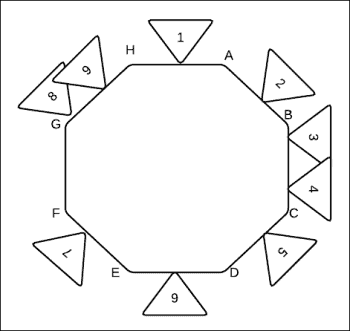
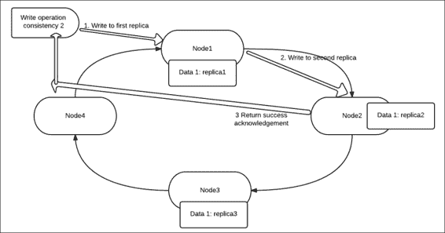

# 第七章。Cassandra 分区、高可用性和一致性

在本章中，你将了解 Cassandra 的内部，学习数据分区是如何实现的，你将了解 Cassandra 的键集分布上采用的哈希技术。我们还将深入了解复制以及它的工作原理，以及暗示的传递特性。我们将涵盖以下主题：

+   数据分区和一致性哈希；我们将看一些实际例子

+   复制、一致性和高可用性

# 一致性哈希

在你理解它在 Cassandra 中的含义和应用之前，让我们先了解一致性哈希作为一个概念。

一致性哈希按照其名称的概念工作——即*哈希*，正如我们所知，对于一个给定的哈希算法，相同的键将始终返回相同的哈希码——因此，这种方法在本质和实现上都是非常确定的。当我们将这种方法用于在集群中的节点之间进行分片或划分键时，一致性哈希是一种确定哪个节点存储在集群中的哪个节点的技术。

看一下下面的图表，理解一致性哈希的概念；想象一下下面图表中所描述的环代表 Cassandra 环，这里标记的节点是用字母标记的，实际上标记了要映射到环上的对象（倒三角形）。



Cassandra 集群的一致性哈希

要计算对象所属的节点的所有权，只需要顺时针遍历，遇到下一个节点即可。跟随数据项（倒三角形）的节点就是拥有该对象的节点，例如：

+   **1**属于节点**A**

+   **2**属于节点**B**

+   **3**属于节点**C**

+   **4**属于节点**C**

+   **5**属于节点**D**

+   **6**属于节点**E**

+   **7**属于节点**F**

+   **8**属于节点**H**

+   **9**属于节点**H**

所以你看，这使用简单的哈希来计算环中键的所有权，基于拥有的标记范围。

让我们看一个一致性哈希的实际例子；为了解释这一点，让我们以一个样本列族为例，其中分区键值是名称。

假设以下是列值数据：

| 名字 | 性别 |
| --- | --- |
| Jammy | M |
| Carry | F |
| Jesse | M |
| Sammy | F |

这是哈希映射的样子：

| 分区键 | 哈希值 |
| --- | --- |
| Jim | 2245462676723220000.00 |
| Carol | 7723358927203680000.00 |
| Johnny | 6723372854036780000.00 |
| Suzy | 1168604627387940000.00 |

假设我有四个节点，具有以下范围；数据将如何分布：

| 节点 | 起始范围 | 结束范围 | 分区键 | 哈希值 |
| --- | --- | --- | --- | --- |
| A | 9223372036854770000.00 | 4611686018427380000.00 | Jammy | 6723372854036780000.00 |
| B | 4611686018427380000.00 | 1.00 | Jesse | 2245462676723220000.00 |
| C | 0.00 | 4611686018427380000.00 | suzy | 1168604627387940000.00 |
| D | 4611686018427380000.00 | 9223372036854770000.00 | Carry | 7723358927203680000.00 |

现在你已经理解了一致性哈希的概念，让我们来看看一个或多个节点宕机并重新启动的情况。

## 一个或多个节点宕机

我们目前正在看一个非常常见的情况，即我们设想一个节点宕机；例如，在这里我们捕捉到两个节点宕机：**B**和**E**。现在会发生什么？嗯，没什么大不了的，我们会像以前一样按照相同的模式进行，顺时针移动以找到下一个活动节点，并将值分配给该节点。

所以在我们的情况下，分配将改变如下：


在前面图中的分配如下：

+   **1**属于**A**

+   **2**，**3**和**4**属于**C**

+   **5**属于**D**

+   **6**，**7**属于**F**

+   **8**，**9**属于**H**

## 一个或多个节点重新上线

现在让我们假设一个场景，节点 **2** 再次上线；那么接下来的情况与之前的解释相同，所有权将重新建立如下：

+   **1** 属于 **A**

+   **2** 属于 **B**

+   **3** 和 **4** 属于 **C**

+   **5** 属于 **D**

+   **6** 和 **7** 属于 **F**

+   **8** 和 **9** 属于 **H**

因此，我们已经证明了这种技术适用于所有情况，这就是为什么它被使用的原因。

# Cassandra 中的复制和策略

复制意味着创建一个副本。这个副本使数据冗余，因此即使一个节点失败或宕机，数据也是可用的。在 Cassandra 中，您可以选择在创建 keyspace 的过程中指定复制因子，或者稍后修改它。在这种情况下需要指定的属性如下：

+   **复制因子**：这是指定副本数量的数字值

+   **策略**：这可以是简单策略或拓扑策略；这决定了在集群中的副本放置

在内部，Cassandra 使用行键在集群的各个节点上存储数据的副本或复制。复制因子 *n* 意味着数据在 *n* 个不同节点上有 *n* 个副本。复制有一些经验法则，它们如下：

+   复制因子不应该大于集群中节点的数量，否则由于副本不足，Cassandra 将开始拒绝写入和读取，尽管复制因子将继续不间断地进行

+   如果复制因子太小，那么如果一个奇数节点宕机，数据将永远丢失

**Snitch** 用于确定节点的物理位置，例如彼此的接近程度等，在大量数据需要复制和来回移动时具有价值。在所有这些情况下，网络延迟都起着非常重要的作用。Cassandra 目前支持的两种策略如下：

+   **简单**：这是 Cassandra 为所有 keyspaces 提供的默认策略。它使用一个数据中心。它的操作非常简单直接；正如其名称所示，分区器检查键值对与节点范围的关系，以确定第一个副本的放置位置。然后，后续的副本按顺时针顺序放置在下一个节点上。因此，如果数据项 "A" 的复制因子为 "3"，并且分区器根据键和所有权决定了第一个节点，那么在这个节点上，后续的副本将按顺时针顺序创建。

+   **网络**：这是当我们的 Cassandra 集群分布在多个数据中心时使用的拓扑。在这里，我们可以规划我们的副本放置，并定义我们想要在每个数据中心放置多少副本。这种方法使数据地理冗余，因此在整个数据中心崩溃的情况下更加安全。在选择跨数据中心放置副本时，应考虑以下两个因素：

+   每个数据中心都应该是自给自足的，以满足请求

+   故障转移或崩溃情况

如果在一个数据中心中有 *2 个数据副本*，那么我们就有四份数据副本，每个数据中心对一节点故障有一份数据的容忍度，以保持一致性 `ONE`。如果在一个数据中心中有 *3 个数据副本*，那么我们就有六份数据副本，每个数据中心对多个节点故障有一份数据的容忍度，以保持一致性 `ONE`。这种策略也允许不对称复制。

# Cassandra 一致性

正如我们在前面的章节中所说，Cassandra 最终变得一致，并遵循 CAP 定理的 AP 原则。一致性指的是 Cassandra 集群中所有数据副本的信息有多新。Cassandra 最终保证一致性。现在让我们仔细看一下；假设我有一个由五个节点组成的 Cassandra 集群，复制因子为 3。这意味着如果我有一个*数据项 1*，它将被复制到三个节点，比如节点 1、节点 2 和节点 3；假设这个数据的键是*键 1*。现在，如果要重写此键的值，并且在节点 1 上执行写操作，那么 Cassandra 会在内部将值复制到其他副本，即节点 2 和节点 3。但此更新是在后台进行的，不是立即的；这就是最终一致性的机制。

Cassandra 提供了向（读和写）客户端应用程序提供决定使用何种一致性级别来读取和写入数据存储的概念。

## 写一致性

让我们仔细检查一下 Cassandra 中的写操作。当在 Cassandra 中执行写操作时，客户端可以指定操作应执行的一致性级别。

这意味着，如果复制因子为*x*，并且使用一致性为*y*（其中 y 小于 x）执行写操作，那么 Cassandra 将在成功写入*y*个节点后，才向客户端返回成功的确认，并标记操作为完成。对于剩余的*x-y*个副本，数据将由 Cassandra 进程在内部传播和复制。

以下表格显示了各种一致性级别及其含义，其中`ANY`具有最高可用性和最低一致性的优势，而`ALL`提供最高一致性但最低可用性。因此，作为客户端，在决定选择哪种一致性之前，必须审查使用情况。以下是一张包含一些常见选项及其含义的表格：

| 一致性级别 | 含义 |
| --- | --- |
| ANY | 当数据写入至少一个节点时，写操作将返回成功，其中节点可以是副本节点或非副本节点 |
| ONE | 当数据写入至少一个副本节点时，写操作将返回成功 |
| TWO | 当数据写入至少两个副本节点时，写操作将返回成功 |
| QUORUM | 当数据写入副本节点的法定副本数（法定副本数为 n/2+1，n 为复制因子）时，写操作将返回成功 |
| ALL | 当数据写入所有副本节点时，写操作将返回成功 |

以下图表描述了在具有复制因子**3**和一致性**2**的四节点集群上的写操作：



因此，正如您所看到的，写操作分为三个步骤：

+   从客户端发出写操作

+   写操作在**副本 1**上执行并完成

+   写操作在**副本 2**上执行并完成

+   当写操作成功完成时，向客户端发出确认

## 读一致性

读一致性类似于写一致性，它表示在将结果返回给查询 Cassandra 数据存储的客户端之前，应有多少副本响应或确认其与返回的数据的一致性。这意味着，如果在具有复制因子*x*的*N*节点集群上，使用读一致性*y*（y 小于 x）发出读查询，则 Cassandra 将检查*y*个副本，然后返回结果。结果将根据使用最新数据来满足请求，并通过与每个列关联的时间戳进行验证。

以下**Cassandra 查询语言**（**CQL**），使用四分一一致性从列族中获取数据如下：

```scala
SELECT * FROM mytable USING CONSISTENCY QUORUM WHERE name='shilpi';

```

CQL 的功能如下：

| 一致性级别 | 含义 |
| --- | --- |
| ONE | 读请求由最近的副本的响应服务 |
| TWO | 读请求由最近的两个副本中的一个最新响应服务 |
| THREE | 此级别从最近的三个副本返回最新的数据 |
| QUORUM | 读请求由大多数副本的最新响应服务 |
| ALL | 读请求由所有副本的最新响应服务 |

## 一致性维护功能

在前一节中，我们深入讨论了读取和写入一致性，清楚的一点是 Cassandra 在执行读取或写入操作时不提供或不努力实现总一致性；它根据客户端的一致性规范执行并完成请求。另一个特性是*最终一致性*，它强调了在幕后有一些魔法，保证最终所有数据将是一致的。现在这个魔法是由 Cassandra 内部的某些组件执行的，其中一些如下所述：

+   **读修复**：此服务确保所有副本之间的数据是最新的。这样，行就是一致的，并且已经使用最新的值更新了所有副本。此操作由作业执行。Cassandra 正在运行以执行由协调员发出的读修复操作。

+   **反熵修复服务**：此服务确保不经常读取的数据，或者当一个宕机的主机重新加入时，处于一致的状态。这是一个常规的集群维护操作。

+   **提示性交接**：这是 Cassandra 上另一个独特而奇妙的操作。当执行写操作时，协调员向所有副本发出写操作，而不管指定的一致性，并等待确认。一旦确认计数达到操作的一致性上提到的值，线程就完成了，并且客户端被通知其成功。在剩余的副本上，使用提示性交接写入值。当一些节点宕机时，提示性交接方法是一个救世主。假设其中一个副本宕机，并且使用`ANY`的一致性执行写操作；在这种情况下，一个副本接受写操作并提示给当前宕机的相邻副本。当宕机的副本恢复时，然后从活动副本获取提示将值写回它们。

# 测验时间

Q.1\. 判断以下陈述是真还是假：

1.  Cassandra 有一个默认的`ALL`一致性。

1.  `QUORUM`是提供最高可用性的一致性级别。

1.  Cassandra 使用一个 snitch 来识别节点的接近程度。

1.  Cassandra 的读写特性默认具有一致性级别 1。

Q.2\. 填空：

1.  _______________ 用于确定节点的物理接近程度。

1.  _______________ 是提供最高可用性和最低可用性的一致性。

1.  _______________ 是确保宕机一段时间的节点正确更新为最新更改的服务。

Q.3\. 执行以下用例以查看 Cassandra 的高可用性和复制：

1.  创建一个四节点的 Cassandra 集群。

1.  创建一个副本因子为 3 的键空间。

1.  在这个键空间下的列族中添加一些数据。

1.  尝试使用`ALL`在选择查询中使用读一致性来检索数据。

1.  关闭一个节点上的 Cassandra 守护程序，并从其他三个活动节点重复第 4 步。

1.  关闭一个节点上的 Cassandra 守护程序，并使用`ANY`的一致性从其他三个活动节点重复第 4 步。

1.  关闭两个节点并使用`ANY`的写一致性更新现有值。

1.  尝试使用`ANY`进行读取。

1.  将宕机的节点恢复并从所有四个节点上使用一致性`ALL`执行`read`操作。

# 摘要

在本章中，您已经了解了 Cassandra 中的复制和数据分区的概念。我们还了解了复制策略和最终一致性的概念。本章末尾的练习是一个很好的实践练习，可以帮助您以实际方式理解本章涵盖的概念。

在下一章中，我们将讨论八卦协议、Cassandra 集群维护和管理特性。
